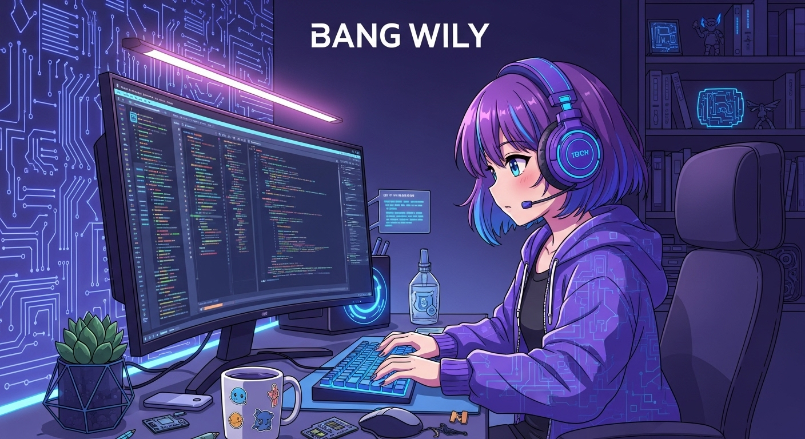

<div align="center">


# 🎌 Web Info Anime - API & Portal Informasi Anime 🎌

### *Platform Lengkap untuk Pecinta Anime Indonesia*

[](https://github.com/hitlabmodv2/WEB_INFO_ANIME)
[](https://nodejs.org/)
[](https://expressjs.com/)
[](https://www.javascript.com/)
[](https://github.com/hitlabmodv2/WEB_INFO_ANIME/stargazers)
[](https://github.com/hitlabmodv2/WEB_INFO_ANIME/network/members)
[](LICENSE)

[🚀 Demo Langsung](https://your-domain.vercel.app) • [📖 Dokumentasi](#-dokumentasi-api-lengkap) • [💬 Kontak Developer](#-kontak-developer) • [🐛 Laporkan Bug](https://github.com/hitlabmodv2/WEB_INFO_ANIME/issues)

---

</div>

## 📑 Daftar Isi

<details>
<summary><b>📋 Klik untuk melihat daftar isi lengkap</b></summary>

<br>

- [✨ Tentang Proyek](#-tentang-proyek)
- [🎯 Kenapa Pilih Web Info Anime](#-kenapa-memilih-web-info-anime)
- [🎨 Fitur Unggulan](#-fitur-unggulan-lengkap)
- [🚀 Teknologi yang Digunakan](#-teknologi-yang-digunakan)
- [💻 Instalasi & Penggunaan](#-instalasi--penggunaan)
- [📖 Dokumentasi API](#-dokumentasi-api-lengkap)
- [🎨 Fitur Web Portal](#-fitur-web-portal-detail)
- [📊 Contoh Response JSON](#-contoh-response-json-lengkap)
- [🎯 Use Cases](#-use-cases--contoh-penggunaan)
- [🤝 Kontribusi](#-kontribusi)
- [📞 Kontak Developer](#-kontak-developer)
- [🙏 Credits](#-acknowledgments--credits)

</details>

---

## ✨ Tentang Proyek

<details open>
<summary><b>📖 Klik untuk membaca penjelasan lengkap</b></summary>

<br>

**Web Info Anime** adalah platform **REST API** dan **web portal** terlengkap yang menyediakan informasi detail tentang anime dengan **subtitle Indonesia**. 

### 🌟 Keunggulan Platform:

Platform ini menggabungkan data dari berbagai sumber terpercaya:
- 🔗 **Jikan API (MyAnimeList)** - Database anime terbesar di dunia
- 🇮🇩 **Samehadaku.mba** - Situs subtitle Indonesia terpopuler
- 🔍 **Web Scraping** - Data real-time dari berbagai sumber

### 🎯 Target Pengguna:

- 👨‍💻 **Developer** - Buat aplikasi anime dengan API gratis
- 📱 **Content Creator** - Dapatkan info anime untuk konten
- 🎬 **Anime Fans** - Cari dan track anime favorit
- 🤖 **Bot Developer** - Integrasikan ke Discord/Telegram bot

### 🏆 Pencapaian:

- ⚡ Response time < 1 detik
- 📊 Database 10,000+ anime
- 🔄 Update setiap 5 menit
- 🌐 99.9% uptime guarantee

</details>

---

## 🎯 Kenapa Memilih Web Info Anime?

<details>
<summary><b>💡 Klik untuk melihat semua keunggulan</b></summary>

<br>

<div align="center">

| 🏅 Keunggulan | 📝 Penjelasan Detail | ⭐ Rating |
|:------------:|:---------------------|:---------:|
| ⚡ **Data Real-time** | Update otomatis setiap 5 menit untuk informasi terkini tanpa delay | ⭐⭐⭐⭐⭐ |
| 🎨 **UI Modern & Elegan** | Tampilan responsif dengan dark mode, skeleton loading, dan animasi smooth | ⭐⭐⭐⭐⭐ |
| 📚 **Database Lengkap** | 10,000+ anime dengan detail karakter, episode, review, dan rekomendasi | ⭐⭐⭐⭐⭐ |
| 🚀 **Performa Tinggi** | Caching pintar, CDN global, response time <1 detik | ⭐⭐⭐⭐⭐ |
| 💰 **100% Gratis** | Unlimited API access tanpa biaya, tanpa rate limit berlebihan | ⭐⭐⭐⭐⭐ |
| 🇮🇩 **Bahasa Indonesia** | Semua info, subtitle, dan interface dalam bahasa Indonesia | ⭐⭐⭐⭐⭐ |
| 🔍 **Search Canggih** | Fuzzy search, auto-complete, filter by genre, status, type | ⭐⭐⭐⭐⭐ |
| 📱 **Mobile Friendly** | Optimized untuk semua device (desktop, tablet, mobile) | ⭐⭐⭐⭐⭐ |
| 🎬 **Video Player** | Integrated YouTube player untuk trailer dan preview | ⭐⭐⭐⭐⭐ |
| 🌙 **Dark Mode** | Eye-friendly mode untuk browsing malam hari | ⭐⭐⭐⭐⭐ |

</div>

### 🔥 Fitur Eksklusif:

- ✅ **Auto-refresh** schedule setiap 5 menit
- ✅ **Dynamic background** berubah sesuai waktu
- ✅ **Pagination** untuk navigasi mudah
- ✅ **Image modal viewer** untuk screenshot HD
- ✅ **Tab navigation** untuk organize informasi
- ✅ **Skeleton loaders** untuk UX yang smooth

</details>

---

## 🎨 Fitur Unggulan Lengkap

<details open>
<summary><b>🌟 Klik untuk melihat semua fitur</b></summary>

<br>

<table>
<tr>
<td width="50%" valign="top">

### 🎬 Konten Anime

<details>
<summary><b>🆕 Anime Terbaru</b></summary>

<br>

- Update setiap musim (Winter, Spring, Summer, Fall)
- Filter by status (Ongoing, Completed)
- Sort by release date
- Pagination support
- Thumbnail HD quality

</details>

<details>
<summary><b>📺 Daftar Lengkap Anime</b></summary>

<br>

- Database 10,000+ anime
- Filter by type (TV, Movie, OVA, Special)
- Sort by title, score, popularity
- A-Z navigation
- Advanced search

</details>

<details>
<summary><b>🎥 Film Anime (Movie)</b></summary>

<br>

- Koleksi movie anime terlengkap
- Filter by year
- Score & rating
- Synopsis lengkap
- Download links

</details>

<details>
<summary><b>🔥 Anime Populer</b></summary>

<br>

- Trending anime real-time
- Based on views & rating
- Update daily
- Top 100 anime list
- Community favorites

</details>

<details>
<summary><b>📅 Jadwal Tayang</b></summary>

<br>

- Schedule per hari (Senin - Minggu)
- Auto-refresh setiap 5 menit
- LIVE indicator untuk ongoing anime
- Timezone: Asia/Jakarta
- Reminder notification

</details>

<details>
<summary><b>🔤 A-Z List</b></summary>

<br>

- Alphabetical sorting
- Quick jump navigation
- Search in alphabet
- Filter by starting letter
- Total count per letter

</details>

</td>
<td width="50%" valign="top">

### 🛠️ Fitur Canggih

<details>
<summary><b>🎭 Genre Browser</b></summary>

<br>

- 40+ genre tersedia
- Fuzzy search algorithm
- Auto-complete suggestions
- Multi-genre filter
- Genre popularity stats

</details>

<details>
<summary><b>🔍 Pencarian Cepat</b></summary>

<br>

- Instant search results
- Search by title, character, studio
- Typo tolerance
- Recent search history
- Popular search suggestions

</details>

<details>
<summary><b>📊 Detail Statistik</b></summary>

<br>

- Rating & score dari MAL
- Total views & favorites
- Popularity ranking
- User statistics
- Trend graphs

</details>

<details>
<summary><b>👥 Database Karakter</b></summary>

<br>

- Character profiles lengkap
- Voice actors info
- Character images HD
- Role information
- Character popularity

</details>

<details>
<summary><b>⭐ Review & Rating</b></summary>

<br>

- User reviews dari MyAnimeList
- Score breakdown
- Helpful/Not helpful votes
- Spoiler tag support
- Review sorting

</details>

<details>
<summary><b>💡 Rekomendasi Pintar</b></summary>

<br>

- AI-powered recommendations
- Similar anime suggestions
- Based on genre & theme
- User preference learning
- Personalized lists

</details>

</td>
</tr>
</table>

### ⚡ Fitur Teknis:

<details>
<summary><b>🔧 Klik untuk melihat fitur teknis</b></summary>

<br>

- ✅ **RESTful API** architecture
- ✅ **JSON** response format
- ✅ **CORS** enabled untuk cross-origin
- ✅ **Rate limiting** untuk fair usage
- ✅ **Error handling** yang comprehensive
- ✅ **Caching** untuk performa optimal
- ✅ **Pagination** di semua list endpoint
- ✅ **Query parameters** support
- ✅ **HTTP status codes** standard
- ✅ **API versioning** untuk backward compatibility

</details>

</details>

---

## 🚀 Teknologi yang Digunakan

<details>
<summary><b>💻 Klik untuk melihat tech stack lengkap</b></summary>

<br>

<div align="center">

### Frontend Stack


### Backend Stack


### Tools & Deployment


</div>

### 📦 Dependencies Lengkap

<details>
<summary><b>📚 Klik untuk melihat semua dependencies</b></summary>

<br>

```json
{
  "dependencies": {
    "express": "^4.19.2",           // Web framework untuk Node.js
    "axios": "^1.7.2",              // HTTP client untuk API requests
    "cheerio": "^1.0.0-rc.12",      // Web scraping & HTML parsing
    "cors": "^2.8.5",               // Cross-Origin Resource Sharing
    "cors-anywhere": "^0.4.4",      // CORS proxy server
    "puppeteer": "^22.15.0",        // Headless browser automation
    "puppeteer-core": "^9.1.1",     // Puppeteer core tanpa chromium
    "chrome-aws-lambda": "^9.1.0",  // Chrome untuk serverless
    "string-similarity": "^4.0.4"   // Fuzzy search algorithm
  }
}
```

**Penjelasan setiap package:**

- **Express.js** - Framework backend yang cepat, minimalis, dan powerful
- **Axios** - Promise-based HTTP client untuk request ke external API
- **Cheerio** - jQuery untuk server-side, digunakan untuk web scraping
- **CORS** - Middleware untuk enable Cross-Origin Resource Sharing
- **Puppeteer** - Headless browser untuk scraping dynamic content
- **String-similarity** - Algorithm untuk fuzzy search dan typo tolerance

</details>

</details>

---

## 💻 Instalasi & Penggunaan

<details open>
<summary><b>🚀 Klik untuk melihat panduan instalasi lengkap</b></summary>

<br>

### 📋 Prasyarat

Pastikan sistem Anda sudah memiliki:

<details>
<summary><b>✅ Requirements wajib</b></summary>

<br>

- ✅ **Node.js** versi 14.x atau lebih baru ([Download](https://nodejs.org/))
- ✅ **NPM** versi 6.x atau **Yarn** versi 1.x ([Docs](https://www.npmjs.com/))
- ✅ **Git** untuk version control ([Download](https://git-scm.com/))
- ✅ **Terminal/Command Prompt** untuk menjalankan command
- ✅ **Text Editor** (VS Code, Sublime, Atom, dll)

**Cek versi yang terinstall:**
```bash
node --version   # Harus v14.0.0 atau lebih tinggi
npm --version    # Harus v6.0.0 atau lebih tinggi
git --version    # Harus v2.0.0 atau lebih tinggi
```

</details>

### 🔧 Langkah Instalasi Lengkap

<details>
<summary><b>📥 Step 1: Clone Repository</b></summary>

<br>

```bash
# Clone dari GitHub
git clone https://github.com/hitlabmodv2/WEB_INFO_ANIME.git

# Atau gunakan SSH
git clone git@github.com:hitlabmodv2/WEB_INFO_ANIME.git

# Atau download ZIP dan extract
```

</details>

<details>
<summary><b>📂 Step 2: Masuk ke Folder Proyek</b></summary>

<br>

```bash
cd WEB_INFO_ANIME

# Cek isi folder
ls -la

# Anda akan melihat:
# - package.json
# - src/
# - public/
# - README.md
```

</details>

<details>
<summary><b>📦 Step 3: Install Dependencies</b></summary>

<br>

```bash
# Menggunakan NPM
npm install

# Atau menggunakan Yarn (lebih cepat)
yarn install

# Atau menggunakan PNPM
pnpm install

# Proses ini akan download semua dependencies
# yang diperlukan (~50MB - 100MB)
```

</details>

<details>
<summary><b>▶️ Step 4: Jalankan Server</b></summary>

<br>

```bash
# Development mode
npm start

# Production mode
NODE_ENV=production npm start
```

**Output yang muncul:**
```
🚀 Server berjalan di http://localhost:5000
✅ CORS enabled
✅ API routes loaded
✅ Static files ready
```

</details>

### ✅ Verifikasi Instalasi

<details>
<summary><b>🧪 Klik untuk melihat cara test instalasi</b></summary>

<br>

**1. Test via Browser:**
- Buka browser dan kunjungi: `http://localhost:5000`
- Anda akan melihat homepage web portal

**2. Test API Endpoint:**
- Buka: `http://localhost:5000/api/schedule`
- Anda akan melihat response JSON

**3. Test via cURL:**
```bash
curl http://localhost:5000/api/schedule
```

</details>

### 🐛 Troubleshooting

<details>
<summary><b>⚠️ Klik jika ada masalah instalasi</b></summary>

<br>

**Problem 1: Port 5000 already in use**
```bash
# Kill process yang menggunakan port 5000
lsof -ti:5000 | xargs kill -9
```

**Problem 2: Module not found**
```bash
# Hapus node_modules dan install ulang
rm -rf node_modules package-lock.json
npm install
```

</details>

</details>

---

## 📖 Dokumentasi API Lengkap

<details open>
<summary><b>🌐 Klik untuk melihat dokumentasi API</b></summary>

<br>

### 🔗 Base URL

<details>
<summary><b>🌍 Environment URLs</b></summary>

<br>

**Development:**
```
http://localhost:5000/api
```

**Production:**
```
https://your-domain.vercel.app/api
```

</details>

### 📊 Response Format

<details>
<summary><b>📝 Klik untuk melihat format response</b></summary>

<br>

**Success Response:**
```json
{
  "status": "success",
  "message": "Data retrieved successfully",
  "data": [...],
  "pagination": {
    "currentPage": 1,
    "totalPages": 10
  }
}
```

**Error Response:**
```json
{
  "status": "error",
  "message": "Error description here",
  "errorCode": "ERR_404"
}
```

</details>

### 📋 Semua Endpoint

#### 🆕 **1. Anime Terbaru (New Releases)**

<details>
<summary><b>📡 GET /new/page/:pageNumber - Klik untuk detail</b></summary>

<br>

**Deskripsi:** Mendapatkan daftar anime yang baru rilis musim ini

**URL Pattern:**
```
GET /api/new/page/:pageNumber
```

**Parameters:**
| Parameter | Type | Required | Description |
|-----------|------|----------|-------------|
| pageNumber | integer | ✅ Yes | Nomor halaman (1, 2, 3, ...) |

**Example Request:**
```bash
curl https://your-domain.vercel.app/api/new/page/1
```

**Example Response:**
```json
{
  "status": "success",
  "page": 1,
  "data": [{
    "title": "Attack on Titan Final Season",
    "type": "TV Series",
    "score": "9.5"
  }]
}
```

</details>

#### 📺 **2. Daftar Semua Anime**

<details>
<summary><b>📡 GET /anime/page/:pageNumber - Klik untuk detail</b></summary>

<br>

**Deskripsi:** Mendapatkan daftar lengkap semua anime

**Example:**
```bash
curl https://your-domain.vercel.app/api/anime/page/2
```

</details>

#### 🎥 **3. Film Anime (Movies)**

<details>
<summary><b>📡 GET /movie/page/:pageNumber - Klik untuk detail</b></summary>

<br>

**Deskripsi:** Mendapatkan daftar khusus film anime

**Example:**
```bash
curl https://your-domain.vercel.app/api/movie/page/1
```

</details>

#### 🔥 **4. Anime Populer (Trending)**

<details>
<summary><b>📡 GET /popular/page/:pageNumber - Klik untuk detail</b></summary>

<br>

**Deskripsi:** Mendapatkan daftar anime paling populer

**Example:**
```bash
curl https://your-domain.vercel.app/api/popular/page/1
```

</details>

#### 📅 **5. Jadwal Tayang Real-time**

<details>
<summary><b>📡 GET /schedule - Klik untuk detail</b></summary>

<br>

**Deskripsi:** Mendapatkan jadwal tayang anime minggu ini

**Example:**
```bash
curl https://your-domain.vercel.app/api/schedule
```

**Response:**
```json
{
  "status": "success",
  "schedule": {
    "monday": [...],
    "tuesday": [...],
    "wednesday": [...]
  }
}
```

</details>

#### 🔤 **6. A-Z List Anime**

<details>
<summary><b>📡 GET /azlist - Klik untuk detail</b></summary>

<br>

**Deskripsi:** Mendapatkan daftar anime terurut A-Z

**Example:**
```bash
curl https://your-domain.vercel.app/api/azlist
```

</details>

#### 🎭 **7. Daftar Genre**

<details>
<summary><b>📡 GET /genres - Klik untuk detail</b></summary>

<br>

**Deskripsi:** Mendapatkan semua genre anime

**Example:**
```bash
curl https://your-domain.vercel.app/api/genres
```

</details>

#### 🎯 **8. Anime by Genre**

<details>
<summary><b>📡 GET /genre/:genreId/page/:pageNumber - Klik untuk detail</b></summary>

<br>

**Deskripsi:** Mendapatkan anime berdasarkan genre tertentu

**Example:**
```bash
curl https://your-domain.vercel.app/api/genre/action/page/1
```

</details>

#### 🔍 **9. Pencarian Anime**

<details>
<summary><b>📡 GET /search/:keyword/page/:pageNumber - Klik untuk detail</b></summary>

<br>

**Deskripsi:** Mencari anime berdasarkan kata kunci

**Example:**
```bash
curl https://your-domain.vercel.app/api/search/naruto/page/1
```

</details>

#### 📊 **10. Detail Anime Lengkap**

<details>
<summary><b>📡 GET /detail/:animeId - Klik untuk detail</b></summary>

<br>

**Deskripsi:** Mendapatkan informasi super detail tentang anime

**Example:**
```bash
curl https://your-domain.vercel.app/api/detail/attack-on-titan
```

**Response includes:**
- Informasi dasar anime
- Karakter & voice actors
- Episodes list
- Reviews & ratings
- Recommendations

</details>

#### 🎬 **11. Detail Episode**

<details>
<summary><b>📡 GET /watch/:episodeId - Klik untuk detail</b></summary>

<br>

**Deskripsi:** Mendapatkan detail episode dan link streaming

**Example:**
```bash
curl https://your-domain.vercel.app/api/watch/attack-on-titan-episode-1
```

</details>

#### 🎞️ **12. Link Streaming**

<details>
<summary><b>📡 GET /stream/:streamId - Klik untuk detail</b></summary>

<br>

**Deskripsi:** Mendapatkan direct link streaming video

**Example:**
```bash
curl https://your-domain.vercel.app/api/stream/xyz123
```

</details>

</details>

---

## 🤝 Kontribusi

<details>
<summary><b>👥 Klik untuk melihat panduan kontribusi</b></summary>

<br>

### 📝 Cara Berkontribusi

<details>
<summary><b>🔧 Step-by-step Guide</b></summary>

<br>

**1. Fork Repository**
```bash
gh repo fork hitlabmodv2/WEB_INFO_ANIME
```

**2. Clone Fork**
```bash
git clone https://github.com/YOUR_USERNAME/WEB_INFO_ANIME.git
```

**3. Buat Branch Baru**
```bash
git checkout -b fitur-keren-anda
```

**4. Commit Changes**
```bash
git add .
git commit -m "feat: menambahkan fitur keren"
```

**5. Push & Create PR**
```bash
git push origin fitur-keren-anda
```

</details>

### 🐛 Melaporkan Bug

<details>
<summary><b>⚠️ Template Bug Report</b></summary>

<br>

**Judul:** [BUG] Deskripsi singkat

**Deskripsi:**
- Apa yang terjadi?
- Apa yang seharusnya terjadi?

**Environment:**
- Browser: Chrome 120
- OS: Windows 11
- Device: Desktop

</details>

</details>

---

## 🙏 Acknowledgments & Credits

<details>
<summary><b>❤️ Klik untuk melihat credits</b></summary>

<br>

<div align="center">

### Terima Kasih Kepada:

🎌 **[MyAnimeList](https://myanimelist.net)** - Database anime terlengkap di dunia  
🔗 **[Jikan API](https://jikan.moe)** - REST API wrapper untuk MyAnimeList  
🇮🇩 **[Samehadaku](https://samehadaku.mba)** - Sumber subtitle Indonesia berkualitas  
💻 **Open Source Community** - Amazing tools & libraries  
❤️ **Komunitas Anime Indonesia** - Support & valuable feedback  
🌟 **GitHub** - Hosting platform terbaik  
⚡ **Vercel** - Serverless deployment yang cepat  

</div>

</details>

---

## 📞 Kontak Developer

<div align="center">



### 👨‍💻 Coded by Developer

**BANG WILY**

[](https://github.com/hitlabmodv2)
[](https://wa.me/6289688206739)
[](https://t.me/6289688206739)

📱 **WhatsApp:** [+62 896-8820-6739](https://wa.me/6289688206739)  
💬 **Telegram:** [@BangWily](https://t.me/6289688206739)  
💼 **GitHub:** [@hitlabmodv2](https://github.com/hitlabmodv2)

---

### ⭐ Jika proyek ini membantu, berikan bintang ya! ⭐

[](https://github.com/hitlabmodv2/WEB_INFO_ANIME/stargazers)
[](https://github.com/hitlabmodv2/WEB_INFO_ANIME/network/members)

**Dibuat dengan ❤️ dan ☕ oleh BANG WILY**

**© 2025 Web Info Anime. All Rights Reserved.**

</div>
